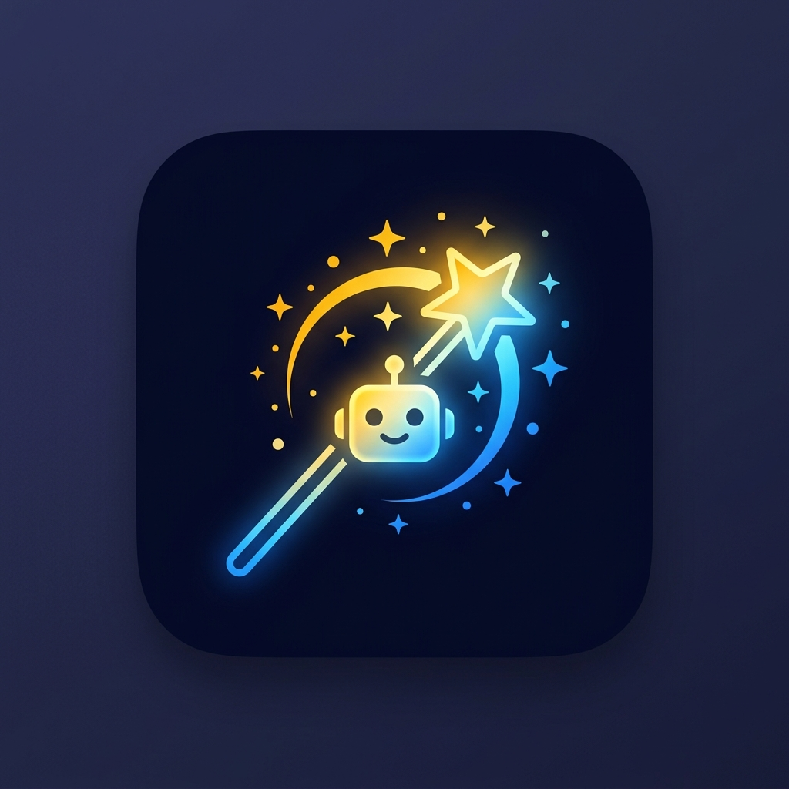

<div align="center">
  
  
  # ✨ AI Prompt Studio
  
  **A premium, offline-capable platform to craft, manage, test, and share powerful AI prompts.**

[](https://github.com/davishkar/AI-Prompt-Studio-Project)
[](LICENSE)
[](manifest.json)

</div>

<br>

## 🚀 Overview

AI Prompt Studio is a zero-dependency, fully client-side Single Page Application (SPA) designed to supercharge your prompt engineering workflow. It features a modern **Glassmorphism/Claymorphism UI**, full offline **PWA** capabilities, and dynamic integration with the **Gemini AI API** (and a demo JSONPlaceholder mode) for live prompt testing.

All data is stored locally in your browser ensuring complete privacy and offline accessibility.

---

## 🌟 Key Features

### 🤖 AI Integration & Testing

- **Dual API Modes:** Test workflows instantly with the Demo Mode (JSONPlaceholder) or switch to Real AI Mode using your Google Gemini API key (`gemini-pro`).
- **Prompt Improver & Scorer:** Get heuristic 0-10 scoring on prompt quality, and click "Improve" for AI-powered structural enhancements.
- **Auto-Suggestions:** Real-time, debounced autocomplete suggestions as you type.

### 🧠 Prompt Management Library

- **Intelligent Organization:** Categorize, tag, search, and filter your saved prompts instantly.
- **Favorites & Pinning:** Star your best prompts to keep them at the top.
- **Full CRUD:** Seamlessly edit, duplicate, drag-and-drop reorder, and permanently delete prompts.

### 🎙️ Advanced I/O

- **Voice Input:** Speak your prompts directly using the Web Speech API.
- **Text-to-Speech (TTS):** Read back generated prompts and AI responses aloud.
- **Multi-language:** Built-in i18n support (English & Marathi).

### 💻 Premium UI / UX

- **Glassmorphism Design:** Beautiful translucent panels, smooth gradients, and micro-animations.
- **True Dark Mode:** Persisted CSS custom property theming (`data-theme="dark"`).
- **Responsive PWA:** Install natively on iOS/Android or Desktop. Includes a sleek mobile-friendly bottom tab bar.
- **Keyboard Power Shortcuts:** `Ctrl+Enter` (Generate), `Ctrl+S` (Save), `Ctrl+Shift+C` (Copy), `Ctrl+D` (Theme toggle).

### 📊 Analytics & Export

- **Dashboard Data:** Track usage history, view the top category pie/bar chart, and instantly restore past prompts.
- **Rich Exporting:** Download Prompts as `.TXT`, `.PDF` (via jsPDF), `.JSON`, or copy as Markdown.
- **Deep Linking:** Share templates via base64 encoded URL hashes.

---

## 🛠️ Tech Stack

**Frontend Only (No Build Step Required)**

- `HTML5` (Semantic layout, PWA Meta tags)
- `CSS3` (Custom Properties, Flexbox/Grid, Glassmorphism)
- `Vanilla JavaScript (ES6)` (State management, API integration, LocalStorage)
- **External Libs:** FontAwesome (Icons), jsPDF (PDF Export), Google Fonts (Inter, Space Grotesk)

---

## 📂 Project Structure

```text
├── index.html        # Main SPA skeleton, 5-tab DOM structure
├── style.css         # Complete design system and responsive rules
├── script.js         # Core logic, API fetching, UI state, PWA initialization
├── manifest.json     # Web App Manifest for PWA installation
├── sw.js             # Service Worker for offline asset caching
├── icon-192.png      # PWA maskable icon (small)
└── icon-512.png      # PWA maskable icon (large)
```

---

## 🏃 Getting Started

Since there is no backend or build step, running AI Prompt Studio is incredibly easy:

### Method 1: Local Server (Recommended for PWA/API testing)

1. Clone the repository:
   ```bash
   git clone https://github.com/davishkar/AI-Prompt-Studio-Project.git
   cd AI-Prompt-Studio-Project
   ```
2. Run a local server (Requires Node.js):
   ```bash
   npx serve .
   ```
3. Open `http://localhost:3000` in your browser.

### Method 2: Direct File (Simple)

Simply double-click the `index.html` file to open it directly in your browser. _(Note: Some features like Service Workers/PWA require an HTTP/HTTPS protocol)._

---

## ⚙️ How to Setup Gemini AI

By default, the app is in **Demo Mode** (JSONPlaceholder) to let you test the UI without an API key. To enable real AI responses:

1. Obtain a free Google Gemini API Key from [Google AI Studio](https://aistudio.google.com/).
2. Open **AI Prompt Studio**.
3. Navigate to the **Settings** tab.
4. Toggle "Enable Gemini AI".
5. Paste your API key (`AIzaSy...`) and click **Save Key**.
6. Navigate back to the **Studio** tab and click **Run AI**.

_(Your key is stored securely in your local browser `localStorage` and is never sent to any external server other than Google's API endpoints)._

---

## 📱 PWA Installation

**Desktop (Chrome/Edge):**
Look for the install icon `⬇️` in the right side of the URL bar, or click the **"Install App"** button located at the bottom of the left sidebar.

**Mobile (iOS Safari):**
Tap the **Share** button at the bottom of the screen, then scroll down and tap **"Add to Home Screen"**.

**Mobile (Android Chrome):**
A prompt should appear asking to "Add AI Prompt Studio to Home screen", or you can tap the 3-dot menu and select **"Install app"**.

---

## 🤝 Contributing

Contributions are welcome! If you have ideas for new prompt templates, better heuristics for the prompt scorer, or additional export formats:

1. Fork the Project
2. Create your Feature Branch (`git checkout -b feature/AmazingFeature`)
3. Commit your Changes (`git commit -m 'Add some AmazingFeature'`)
4. Push to the Branch (`git push origin feature/AmazingFeature`)
5. Open a Pull Request

---

## 📝 License

Distributed under the MIT License. See `LICENSE` for more information.

---

_Designed with ❤️ for prompt engineers._
